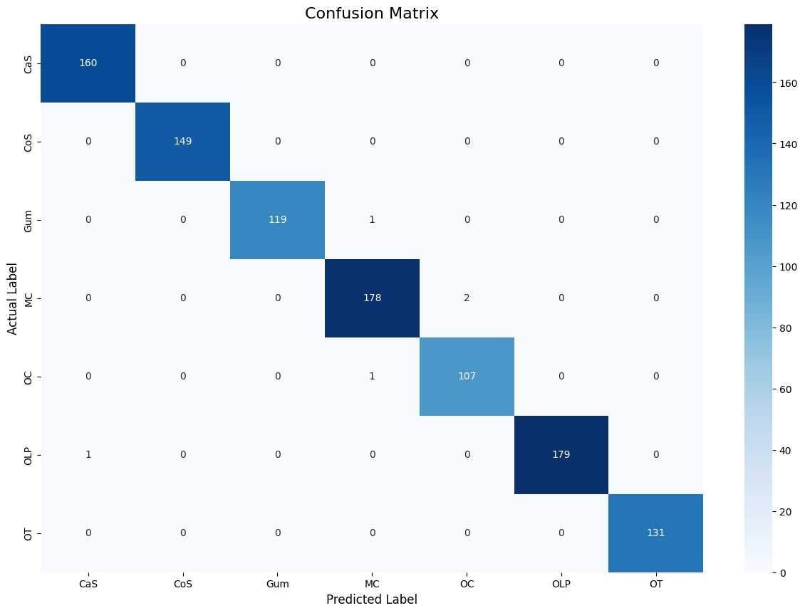
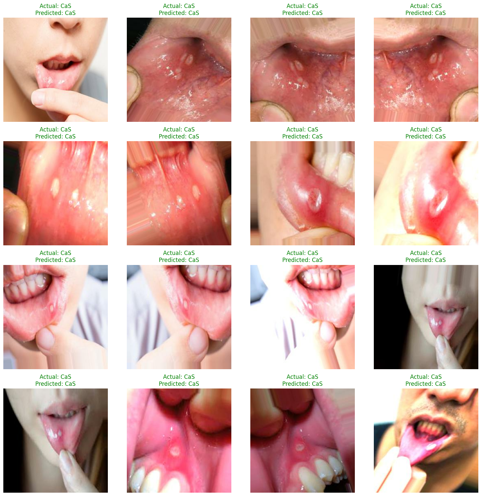

# Teeth Classification with CNNs and Streamlit App


This project provides a comprehensive exploration of deep learning for dental image classification. It includes the training and evaluation of multiple models, from a custom CNN to a fine-tuned ResNet50, and culminates in an interactive web application built with Streamlit for real-time predictions.

### ✨ Live Demo App

A live web application was built to provide an interactive interface for the best-performing model (Fine-Tuned ResNet50). Users can upload a dental image and receive an instant classification.

*(**Suggestion:** Create a short GIF of you using your Streamlit app and place it here. It's very impressive for a portfolio! You can use a tool like LICEcap or ScreenToGif.)*


---

## 📋 Project Overview

The goal of this project is to accurately classify images of human teeth into distinct categories. The model is trained on a dataset of dental images and can identify classes such as 'CaS', 'CoS', 'Gum', 'MC', etc. The project systematically evaluates different deep learning strategies to identify the most effective approach.

### Key Features
*   **Multiple Model Architectures:** Comparison of a custom CNN, Transfer Learning (ResNet50), and Fine-Tuning.
*   **In-depth Evaluation:** Detailed performance analysis using accuracy, loss, classification reports, and confusion matrices.
*   **Interactive Web Interface:** A user-friendly Streamlit app to test the final model with any image.
*   **Reproducible Workflow:** A Jupyter Notebook (`Teeth_Classification.ipynb`) contains all the code for data preprocessing, model training, and evaluation.

---

## 🚀 Model Performance & Results

The models were trained and evaluated on their ability to classify images from the test set. The fine-tuned ResNet50 model achieved the best performance, demonstrating the power of adapting pre-trained models to specific domains.

| Model                               | Test Accuracy | Test Loss |
| ----------------------------------- | :-----------: | :-------: |
| Custom CNN (No Augmentation)        |    55.06%     |   1.3454  |
| Custom CNN (With Augmentation)      |    88.62%     |   0.3489  |
| Transfer Learning - Xception        |    81.61%     |   0.5640  |
| Transfer Learning - ResNet50        |    90.27%     |   0.3466  |
| **Fine-Tuned - ResNet50**           |  **~99.51%**  | **~0.0121** |


### Results from Fine-Tuned ResNet50 Model

Below are the key evaluation metrics for the best-performing model.

| Training & Validation Plots                                     | Confusion Matrix                                         |
| --------------------------------------------------------------- | -------------------------------------------------------- |
|  |  |
|          |  |

---

## ⚙️ How to Run

There are two main parts to this project: running the interactive demo app and re-training the models.

### 1. Running the Interactive Streamlit App

This is the quickest way to see the project in action.

**Prerequisites:**
*   You must have the trained model file `teeth_classification_model_with_FineTune.keras` inside the `Streamlit_App` folder. You can generate this by running the Jupyter Notebook first.

**Instructions:**
1.  **Clone the repository:**
    ```bash
    git clone https://github.com/MohanadMetrash/teeth-classification-deep-learning.git
    cd teeth-classification-deep-learning
    ```

2.  **Install dependencies:**
    ```bash
    pip install -r requirements.txt
    ```

3.  **Navigate to the app directory:**
    ```bash
    cd Streamlit_App
    ```

4.  **Run the app:**
    ```bash
    streamlit run app.py
    ```
    Your web browser will open with the application running locally.

---

## 🛠️ Technologies Used

*   **TensorFlow & Keras:** For building and training the deep learning models.
*   **Streamlit:** For creating the interactive web application.
*   **Scikit-learn:** For performance metrics (classification report, confusion matrix).
*   **Numpy & Pillow:** For numerical operations and image manipulation.
*   **Matplotlib & Seaborn:** For data visualization and plotting results.
*   **Google Colab:** For a cloud-based notebook environment with GPU access.
